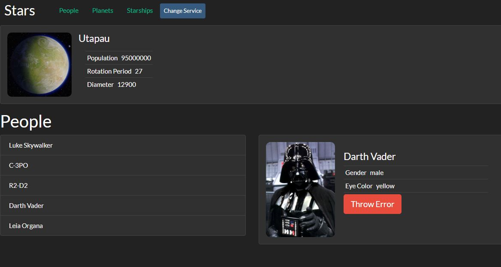
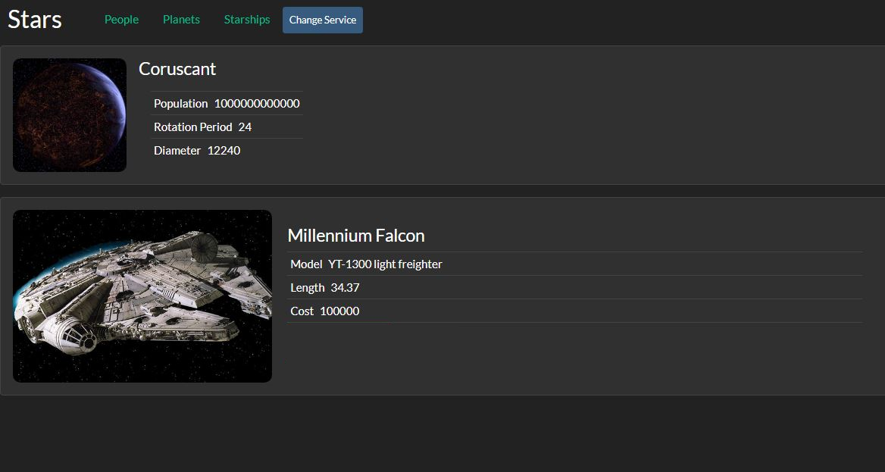

# React/Router App that uses the Star Wars API

This is a React app that uses the wonderful Star Wars API. This Star Wars App is a place where visitors can explore different peoples, starships and planets from the Star Wars universe. Initially the information is displayed as a title list and when the item link is clicked, additional information is displayed.




## Running
```bash
git clone https://github.com/maksymchak/stars.git
npm install
npm start
```
Runs the app in the development mode.  
Open [http://localhost:3000](http://localhost:3000/) to view it in the browser.



## Folder Structure
After creation, your project should look like this:
```
todo-list/
  README.md
  .gitignore
  package.json
  package-lock.json
  assets/
  node_modules/
  public/
    index.html
  src/
    index.js
    services/
  components/
    app/
    error-boundry/
    error-button/
    error-indicator/
    header/
    hoc-helpers/
    item-details/
    item-list/
    pages/
    random-planet/
    row/
    spinner/
    swapi-service-context/
    sw-components/
```
## Builds
```bash
npm run build`
```
Builds the app for production to the `build` folder.
It correctly bundles React in production mode and optimizes the build for the best performance.
The build is minified and the filenames include the hashes.
Your app is ready to be deployed!

## Misc
Follow Me: [LinkedIn](https://www.linkedin.com/in/anton-maksymchak/), [Facebook](https://www.facebook.com/Anton.Maksymchak), [GitHub](https://github.com/maksymchak)
©[Anton Maksymchak](https://github.com/maksymchak) 2018
